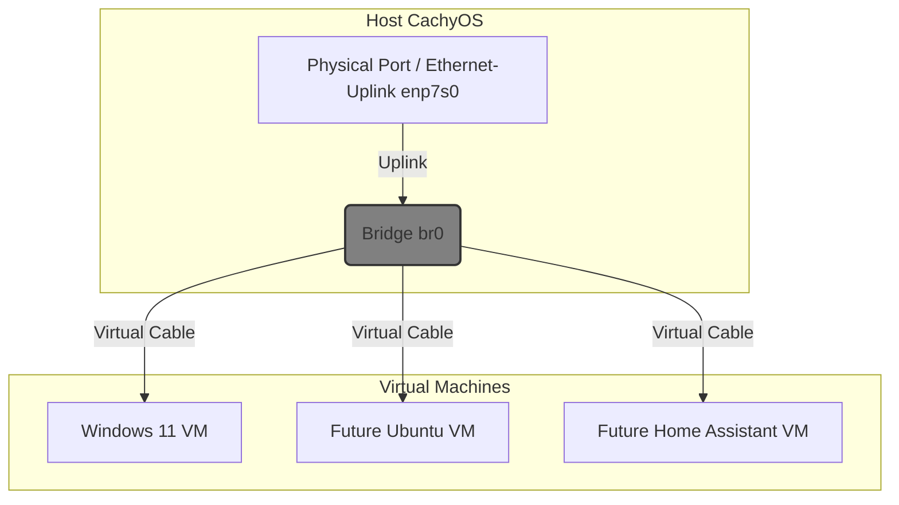

# Windows 11 via Virt-Manager with RDP Setup

**Host:** CachyOS (Arch) \
**iGPU:** Ryzen 7600x \
**Guest:** Windows 11 Pro (Debloated via autounattend)

This repository documents the setting up and configuration for a Windows 11 VM running on my CachyOS PC. I need a quick way to launch Win11 for work purposes - taking teams/zoom calls, super heavy excel/powerpoint slides stuffs and when Im done, back to daily-driving my CachyOS system. At my terminal, when I need to, I simply run the command `go-win11` and the Win11 VM spuns up. 

Also, this fresh Win11 installation skips the "forced" MS-Account requirement, auto create for me a Local Administrator User with a password and need only to "interrupt" OOBE setup for the disk discovery and "where to install Win11 to" part.

Documenting this for the future-me when I move on to another machine and hopefully may help others too as sort of a guide. Note that this is a single-user machine/system.

---

### Table of Contents
- [Downloads & Prerequisites](#downloads--prerequisites)
  - Generating unattend.iso
- [1 - Host Preparation](#1-host-preparation)
  - 1.1 Virtualization support
  - 1.2 KVM modules
  - 1.3 Packages
  - 1.4 Tuned (Host optimization)
  - 1.5 Modular libvirt daemons
  - 1.6 User permissions
  - 1.7 ACL for images
- [2 - Network (Layer 2 Bridge)](#2-network-infrastructure-layer-2-bridge)
- [3 - Virt-Manager: New Win 11 VM Creation](#3-configuring-virt-manager---new-vm-for-fresh-win11-install-wizard)
  - 3.1 ISOs & Installation logic
  - 3.2 Virt-Manager settings
  - 3.3 USB Passthrough
- [4 - Client Access & Automation](#4-client-access--automation)
- [5 - Post-install cleanup](#5-post-installation-cleanup)
- [6 - Guest Tweaks & Performance Notes](#6-guest-level-performanceoptimisation-tweaks)

---

### Downloads & Prerequisites

Before starting, download these three critical ISO files and place them in our ISO directory (e.g., `/var/lib/libvirt/images/`).

| File | Description | Download Link |
| :--- | :--- | :--- |
| **Windows 11 ISO** | The official OS installer. | [Microsoft.com](https://www.microsoft.com/software-download/windows11) |
| **VirtIO Drivers** | Required for KVM to see our Disk/Network. | [Fedora People (Stable)](https://fedorapeople.org/groups/virt/virtio-win/direct-downloads/stable-virtio/virtio-win.iso) |
| **Unattend ISO** | Automates the OOBE & Account Setup. | [Schneegans Generator](https://schneegans.de/windows/unattend-generator/) |

#### Generating the `unattend.iso`
This repo includes a sample `autounattend.xml` file which has been pre-configured to:
* **Bypass** TPM/RAM/Secure Boot checks
* **Create** a local admin user (`username` + `password`) to avoid the Microsoft Account requirement
* **Enable** Remote Desktop automatically.
* **Debloat** almost 99% Windows apps
* **Note** that the setting includes a block on Win11 Pro product key which I do have

**To use it:**
1.  Open the `autounattend.xml` from this repo.
2.  **Edit** the `<Password>`,`<User>` and `<Product_Key>` fields accordingly
3.  Go to the [Schneegans Website](https://schneegans.de/windows/unattend-generator/)
4.  Upload our edited XML (recommended to manually replicate the settings)
5.  **Important!:** At the bottom, choose **"Download as unattend.iso"**
    * *Why:* KVM/QEMU reads answer files reliably from a mounted CD-ROM, whereas USB passthrough for answer files can be flaky during install

---

## 1: Host Preparation

### 1.1 Check Virtualization Support
Run:
```bash
lscpu | grep Virtualization
# Expected: Virtualization: VT-x or AMD-V
```
If empty, enable virtualization in BIOS/UEFI.

### 1.2 Check KVM modules
For Arch:
```bash
zgrep CONFIG_KVM /proc/config.gz
```
Other distros:
```bash
zgrep CONFIG_KVM /boot/config-$(uname -r)
```
Look for CONFIG_KVM= y or m and the vendor modules. If missing, enable appropriate kernel options.

### 1.3 Install required packages

(Arch example)
```bash
sudo pacman -S qemu-full libvirt virt-install virt-manager virt-viewer \
  edk2-ovmf swtpm qemu-img guestfs-tools libosinfo
```

### 1.4 Host tuning with tuned

```bash
yay -S tuned
sudo systemctl enable --now tuned
sudo tuned-adm profile virtual-host
tuned-adm active
# Expect: Current active profile: virtual-host
```

### 1.5 Modular libvirt daemons

Switch to modular daemons (not really needed, monolithic works well too):

```bash
sudo systemctl disable --now libvirtd
sudo systemctl mask libvirtd

for drv in qemu interface network nodedev nwfilter secret storage; do
  sudo systemctl enable virt${drv}d.service
  sudo systemctl enable virt${drv}d{,-ro,-admin}.socket
done

sudo systemctl daemon-reload
sudo reboot
```

### 1.6 Allow a non-root user to manage system VMs

Add user to libvirt group:
```bash
sudo usermod -aG libvirt $USER
```
Edit `/etc/libvirt/libvirtd.conf`:
```ini
unix_sock_group = "libvirt"
unix_sock_rw_perms = "0770"
```
Set default URI in shell:
```bash
echo 'export LIBVIRT_DEFAULT_URI="qemu:///system"' >> ~/.bashrc
```

Unlocked permissions to allow QEMU to run as user (`sfarhan`) instead of `root`.

Edit `/etc/libvirt/qemu.conf`
```ini
user = "sfarhan"
group = "sfarhan"  # (or "kvm")
```
*Reason: This grants the VM permission to later write audio data to our local PulseAudio/PipeWire socket.*

---

### 1.7 ACL for image directory
Grant access to `/var/lib/libvirt/images`:
```bash
sudo setfacl -R -m u:$USER:rwX /var/lib/libvirt/images
sudo setfacl -m d:u:$USER:rwx /var/lib/libvirt/images
```

Tip: If need to clear previous ACLs first:
```bash
sudo setfacl -R -b /var/lib/libvirt/images
```

Now review new ACL permissions on the directory:

```
getfacl /var/lib/libvirt/images
getfacl: Removing leading '/' from absolute path names
# file: var/lib/libvirt/images
# owner: root
# group: root
user::rwx
user:sfarhan:rwx
group::--x
mask::rwx
other::--x
default:user::rwx
default:user:sfarhan:rwx
default:group::--x
default:mask::rwx
default:other::--x
```

Try accessing the /var/lib/libvirt/images directory again as a regular user.

```
touch /var/lib/libvirt/images/test_file

ls -l /var/lib/libvirt/images/
total 0
-rw-rw----+ 1 $USER $USER 0 Feb 12 21:34 test_file
```

Now have full access to the /var/lib/libvirt/images directory.

-----

## 2: Network Infrastructure (Layer 2 Bridge)

**Objective:** The VM must appear as a physical device on the LAN (Bridged) to bypass NAT and achieve full 5GbE throughput that I have.

### Network Topology

  * **Physical:** `enp7s0` (10GbE Network Card) -\> **Slave**
  * **Logical:** `br0` (LAN-Bridge) -\> **Master**
  * **How to find out:** `ip a` command

### Network Manager

Create the bridge and bind the physical card.

```bash
# 1. Create the Bridge (The Master)
nmcli con add type bridge ifname br0 con-name "LAN-Bridge"

# 2. Bind the Physical Card (The Slave)
# Replace 'enp7s0' with our actual physical interface name
nmcli con add type bridge-slave ifname enp7s0 master br0 con-name "Ethernet-Uplink"

# 3. Force Autoconnect (For Headless Boot)
# Ensures the physical card wakes up and joins the bridge immediately on boot.
nmcli connection modify LAN-Bridge connection.autoconnect-slaves 1

# 4. Activate
nmcli con up "LAN-Bridge"
```



----

## 3: Configuring Virt-Manager - "New VM for Fresh Win11 Install" Wizard

When creating the VM in Virt-Manager for a fresh Win11 installation, we must attach **three** CD-ROMs during the initial setup to ensure a "hands-free" installation

### 3.1 The ISOs
In the "New VM" wizard, check **"Customize configuration before install"** \
Then, in the "Add Hardware" section, ensure we have the following layout:

1.  **SATA CDROM 1:** `Windows11_Install.iso` (The Installer) -> **Boot Priority #1**
2.  **SATA CDROM 2:** `virtio-win.iso` (The Drivers)
3.  **SATA CDROM 3:** `unattend.iso` (The Script)
4.  **VirtIO Disk 1:** Physical/Virtual Disk (Target) -> **Boot Priority #2**

<details close>
<summary>The Installation Logic</summary>

1. **Boot:** The VM boots from **CDROM 1** (Windows Installer)

2. **Detection:** Windows Setup silently scans **CDROM 3** (`unattend.iso`)
    * It finds `autounattend.xml`
    * It bypasses the "Language" and "Key" screens, since I set up it up as such. 

3.  **Driver Injection:** If using the *Interactive Partitioning* mode (recommended), click **Load Driver** -> Browse to **CDROM 2** (`virtio-win`) -> `amd64` -> `w11`

4.  **Nuke:** Delete all partitions on **Disk 0** and click Next

5.  **Automation:** The script takes over. It creates the user, sets the password, and logs us directly into the desktop (depending on our autounattend settings)

</details>

### 3.2 Virt-Mangager Settings

  * **Step 1:** Clicked "Create New Virtual Machine" (Monitor icon)
  
  * **Step 2: (Install Method):** Selected **"Local install media (ISO image or CDROM)"**
  
  * **Step 3: (ISO/CO-Drive Selections):** Browsed to Windows 11 ISO + other ISOs
  
  * **Step 4: (Memory & CPU):**
      * **Memory:** Typed `16384` (16GB)
      * **CPUs - Topology:** 4 Cores / 2 Threads (adjust this accordingly to machine)
  
  * **Step 5: (Storage):**
      * **Action:** Unchecked "Enable storage for this virtual machine" (Because we planned to add the physical SSD later manually)
  
  * **Step 6: (Name & Network):**
      * **Name:** `Win11`
      * **Network Selection:** Selected **"Bridge device"** $\rightarrow$ Device name: **`br0`**
      * **Crucial Checkbox:** Checked **"Customize configuration before install"**

**Once we hit Finish, the detailed config window opened.**

---
  
### Additional Settings:

#### **A. Overview (Firmware)**

  * Chipset: `Q35`
  * Firmware: `UEFI x86_64: /usr/share/edk2-ovmf/...` (Selected for UEFI/Secure Boot support)

#### **B. CPUs (The Performance Tuning)**

  * Model: Unchecked "Copy host CPU configuration" $\rightarrow$ Typed `host-passthrough` in the XML (or selected "Host-passthrough" in the dropdown)
  * Topology:
      * Checked "Manually set CPU topology"
      * Sockets: 1
      * Cores: 4
      * Threads: 2 (Total 8 vCPUs)

#### **C. Memory**

  * Current allocation: 16384 MB
  * Shared Memory: Disabled (Enabled for Looking Glass/IVSHMEM if needed later)

#### **D. Add Hardware: TPM**

  * Action: Clicked "Add Hardware"
  * Type: `TPM`
  * Model: `CRB` (Command Response Buffer)
  * Version: `2.0`
  * *Reason:* Mandatory for Windows 11 installation checks.

#### **E. Add Hardware: Storage (Physical SSD)**

* Defined the physical pass-through
* To find out our device details:

  ```bash
  ls -l /dev/disk/by-id/ | grep sda
  lrwxrwxrwx  1 root root   9 Dec  6 07:34 ata-CT500MX500SSD1_2011E2936572 -> ../../sda
  ```

* Action: Clicked "Add Hardware" $\rightarrow$ Storage
* Device Type: `Block device` (or edited XML directly)
* XML Tab: We pasted the specific block to reference the disk by ID:
    
  ```xml
  <disk type='block' device='disk'>
  <driver name='qemu' type='raw' cache='none' io='native'/>
  <source dev='/dev/disk/by-id/ata-YOUR_SSD_ID'/>
  <target dev='vda' bus='virtio'/>
  </disk>
  ```
  * Cache: `none` (Prevents double-caching in RAM)
  * Discard: `unmap` (Enables TRIM support)

* **Advanced Options (GUI):**
  * Disk bus: `VirtIO`
  * Cache mode: `none`
  * Discard mode: `unmap`

#### **F. Add Hardwares - virtio-win.iso + unattend.iso**

  * Action: Clicked "Add Hardware" $\rightarrow$ Storage
  * Device Type: CDROM
  * ISO: Browsed to `virtio-win.iso` and unattend.iso

#### **G. Network Interface (NIC)**

  * Network source: Bridge device `br0`
  * Device model: `virtio`

#### **H. QEMU Guest Agent (Channel)**

* Enables graceful shutdown, clipboard sync, and filesystem freezing:

    * Action: Add Hardware -> Channel
    * Name: org.qemu.guest_agent.0
    * Device Type: UNIX Socket
    * Auto Socket: Checked

#### **I. Audio Backend Switch from Spice to Pulseaudio**

* Audio Backend: Switched from `spice` to `pulseaudio` to bridge the sound without a viewer window.
  ```xml
  <sound model="ich9">
    <audio id="1"/>
    <address type="pci" domain="0x0000" bus="0x00" slot="0x1b" function="0x0"/>
  </sound>
  <audio id='1' type='pulseaudio' serverName='/run/user/1000/pulse/native'>
    <input clientName='Win11-VM'/>
    <output clientName='Win11-VM'/>
  </audio>
  ```
* `1000` is me (UserID)
  
---

### 3.3 USB Hardware Passthrough (Native)

For latency-sensitive devices like my Headset/Microphone (Jabra) and Webcam (Logitech), we use **Libvirt USB Passthrough** instead of RDP redirection. This physically attaches the USB device to the VM, allowing Windows to use its native drivers for better stability.

**Identify USB Devices**
On my CachyOS Host, listing USB devices to find their Vendor/Product IDs:

```bash
lsusb
```

*Example Output:*

```text
Bus 001 Device 007: ID 0b0e:24c7 GN Netcom Jabra Link 380  <-- We want this
Bus 007 Device 002: ID 046d:094c Logitech, Inc. Brio 100   <-- We want this
```

**Add to Virt-Manager**

1.  Open **Virt-Manager** and double-click **Win11** VM.
2.  Click the **Lightbulb Icon** (Show virtual hardware details).
3.  Click **Add Hardware** (Bottom Left).
4.  Select **USB Host Device**.
5.  Find specific device in the list (matching the ID from `lsusb`).
      * *Example:* `001:007 GN Netcom Jabra Link 380`
6.  Click **Finish**.
7.  Repeat for the Webcam and Audio Adapter.

**Verification**

  * **Host Side:** These devices will disappear from our Linux audio mixer (PulseAudio/PipeWire) because the VM has "stolen" them.
  * **Guest Side:** Windows will detect them as local hardware. I can control the Jabra headset buttons and use the Logitech webcam software natively.

----

### 3.4 Notes

#### Hyper-V Enlightenments

```xml
<hyperv mode="custom">
  <relaxed state="on"/>
  <vapic state="on"/>
  <spinlocks state="on" retries="8191"/>
  <vpindex state="on"/>
  <runtime state="on"/>
  <synic state="on"/>
  <stimer state="on"/>
  <tlbflush state="on"/>
  <ipi state="on"/>
  <avic state="on"/>
</hyperv>
```

#### MAC Address Spoofing if Static IP reservation in router failed

Required if router rejects KVM default MACs for static IP assignment. I only change the first 2 digits of the MAC Address to "00":

```xml
<mac address='00:54:::'/>
```

----

## 4: Client Access & Automation

### 4.1 Automated Launcher (`go-win11`)

This [script](/scripts/go-win11.sh.example) checks the VM status, boots it if off, waits for the RDP port to open, and launches the client.

  * **Location:** `~/.local/bin/go-win11`
  * **Logic:** `virsh start` -\> `nc -z` loop -\> `xfreerdp3 / log-in script`

```bash
#!/bin/bash
# Checks if VM is running, boots it, and connects via FreeRDP
# Place in ~./.local/bin/go-win11
...
```

### 4.2 FreeRDP Configuration

Using `xfreerdp3` and created this [Win11-script](scripts/win11.sh.example) to actully auto-logged-in. The auto-launcher script above will call/look for this.

```bash
xfreerdp3 \
  /v:192.168.0.16 \   #adjust IP accordingly!
  /u:$USER \
  /p:$PASSWORD \
  /f \
  /network:lan \
  /size:2560x1440 \
  /scale:100 \
  /scale-desktop:120 \
  /gfx:avc444 \
  +clipboard \
  /audio-mode:1 \
  /cert:ignore \
  /drive:CachyOS,/home/$USER/Shared \
  /smart-sizing
#  /log-level:DEBUG
```

---

## 5: Post-Installation Cleanup

Once we have verified that Windows is running and we can connect via RDP (`go-win11`) automatically, we should remove the installation media to speed up boot times.

1.  **Shutdown** the VM.
2.  Open **Virt-Manager** -> **Details**.
3.  **Remove** `SATA CDROM 1` (Windows Installer).
4.  **Remove** `SATA CDROM 2` (VirtIO Drivers) - *Optional, but recommended.*
5.  **Remove** `SATA CDROM 3` (Unattend ISO).
6.  **Boot Options:** Ensure `VirtIO Disk 1` is now the **only** checked boot device.

**Note:** If we ever need to add more VirtIO hardware (e.g., a balloon driver or new NIC), we can re-attach the `virtio-win.iso` temporarily.

---

## 6. Guest-Level Performance/Optimisation Tweaks

**Performance Benchmark (Host <-> VM):**
 * **Tool:** `iperf3` (10 Parallel Streams).
   **Throughput:** **37.5 Gbps**.
 * **Desired Output:** VirtIO Para-virtualized network driver is functioning correctly, ensuring zero virtualization overhead for WAN traffic.


#### Some Settings, Tweaks and Changes:

Below are the various settings, tweaks and changes I did over at Win11 side:

#### 1\. Re-Disable LSO (Critical for Network Lag)

The VirtIO network driver defaults to "Large Send Offload" (LSO) being **On**. This causes lag spikes because the software driver waits to bundle packets.

  * **Action:** Device Manager \> Network adapters \> Red Hat VirtIO Ethernet \> Advanced
  * **Set:** **Large Send Offload V2 (IPv4)** $\rightarrow$ **Disabled**
  * **Set:** **Large Send Offload V2 (IPv6)** $\rightarrow$ **Disabled**

#### 2\. Power Plan: High Performance

Windows 11 "Balanced" mode tries to park CPU cores to save power. In a VM, this causes "wake-up latency" every time we move the mouse after a pause.

  * **Action:** Control Panel \> Power Options
  * **Select:** **High Performance**. (If don't see it, click "Create a power plan")
  * *Why:* This keeps our Ryzen cores active and ready to process RDP frames instantly.

#### 3\. Mouse Accuracy (The "Floaty" Fix)

RDP sometimes feels "floaty" because Windows applies software acceleration on top of our hardware mouse input.

  * **Action:** Settings \> Bluetooth & devices \> Mouse \> Additional mouse settings \> **Pointer Options**
  * **Uncheck:** **"Enhance pointer precision"**

#### 4\. (Advanced) MSI Mode for VirtIO

Storage and network drivers to use **Message Signaled Interrupts (MSI)** instead of Line-based interrupts.

1.  Download the **MSI Mode Utility v3** (standard tool in the virtualization community).
2.  Run it as Admin.
3.  Look for "Red Hat VirtIO SCSI" and "Red Hat VirtIO Ethernet".
4.  Ensure the box **"MSI"** is checked for both.
5.  If we change anything, click **Apply** and Reboot.

#### 5\. Disable Visual Animations

Windows 11 loves animations (fading windows, sliding menus, shadows). On a physical PC, these are handled by the GPU. In this VM, they are CPU-intensive and choke the RDP stream. Turning them off is the single most effective tweak.

1.  Inside the VM, press **`Win + R`**.
2.  Type **`sysdm.cpl`** and hit Enter.
3.  Go to the **Advanced** tab.
4.  Under **Performance**, click **Settings**.
5.  Select **"Adjust for best performance"**.
      * *Recommended tweak:* Can check off **"Smooth edges of screen fonts"** (so text doesn't look jagged) and **"Show thumbnails instead of icons"** (so can see images), but leave everything else **unchecked**.
6.  Click **Apply**.

**Result:** Windows will pop open instantly instead of "fading" in.

#### 6\. Group Policy: Force the "AVC444" Match

Our client (`xfreerdp3`) is asking for high-quality **AVC444** color (`/gfx:avc444`). We need to force Windows to prioritize this mode instead of trying to negotiate lower-quality bitmap modes.

1.  Inside the VM, press **`Win + R`**, type **`gpedit.msc`**, and hit Enter
2.  Navigate to:
    **Computer Configuration** $\rightarrow$ **Administrative Templates** $\rightarrow$ **Windows Components** $\rightarrow$ **Remote Desktop Services** $\rightarrow$ **Remote Desktop Session Host** $\rightarrow$ **Remote Session Environment**
3.  Locate and **Enable** these three policies:
      * **"Prioritize H.264/AVC 444 Graphics mode for Remote Desktop Connections"** (Matches our client setting)
      * **"Configure H.264/AVC hardware encoding for Remote Desktop Connections"** (Forces the modern pipeline)
      * **"Use the hardware default graphics adapter for all Remote Desktop Services sessions"**
          * *Note:* Since I don't have a physical GPU passed through, this forces Windows to use the most optimal path available (likely the VirtIO driver) rather than the legacy software rasterizer.

**After changing these, open CMD as Admin and run:**

```cmd
gpupdate /force
```

Then **Sign Out** and Sign back in.

#### 7\. "Opening Images" feels slow

The default **Windows 11 Photos App** is heavy. It loads libraries and animations just to show a JPEG. In a VM without a GPU, this feels sluggish.

**Recommendation:** Install a lightweight image viewer like **ImageGlass** or restore the classic **Windows Photo Viewer**. They load instantly because they don't use 3D hardware acceleration for the UI.

#### 8\. Easy File Sharing

* Since I am using `freerdp3`, I don't need complex Samba shares or XML edits to share files. I can just tell the RDP client to "bring a Linux folder with me" when it connects.
* Add the Drive flag line to our `xfreerdp3` command block. We can map our entire home folder or just a specific "Downloads" folder.

  ```bash
  /drive:CachyOS,/home/$USER \
  ```

    *(This tells RDP: "Take the folder `/home/$USER` on Linux and show it as a drive named `CachyOS` inside Windows.")*

* Open **File Explorer** \> **This PC**. We will see a "Network Drive" named **CachyOS**. We can drag and drop files instantly.

----


